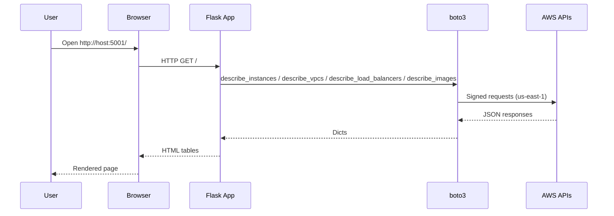
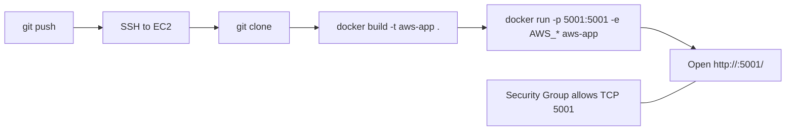

<div align="center">

# AWS Resources Viewer (Flask + Docker)

יישום Flask המציג בטבלאות משאבי AWS (EC2, VPCs, Load Balancers, AMIs) באמצעות boto3. היישום מאזין על פורט 5001 וקורא פרטי גישה ממשתני סביבה.

</div>

## תוכן עניינים
- [סקירה](#סקירה)
- [יכולות](#יכולות)
- [קבצים עיקריים](#קבצים-עיקריים)
- [תצורה](#תצורה)
- [התקנה והרצה](#התקנה-והרצה)
- [פריסה ל-EC2](#פריסה-ל-ec2)
- [ארכיטקטורה ותרשימי זרימה](#ארכיטקטורה-ותרשימי-זרימה)
- [Docker Build (Multi-Stage)](#docker-build-multi-stage)
- [פתרון בעיות](#פתרון-בעיות)

---

## סקירה
היישום מגיש דף HTML עם ארבע טבלאות: EC2 Instances, VPCs, Load Balancers ו‑AMIs בבעלות החשבון. האזור המוגדר הוא `us-east-1`. המימוש מיועד לריצה כקונטיינר Docker קל מקומית או על EC2.

## יכולות
- EC2 Instances: מצב, סוג ו‑Public IP.
- VPCs: מזהה וטווח CIDR.
- Load Balancers (ALB/NLB): שם ו‑DNS.
- AMIs בבעלות החשבון.
- טיפול שגיאות ידידותי כך שהעמוד נטען גם ללא קרדנציאלס/הרשאות מלאות.

## קבצים עיקריים
- `app.py` — יישום Flask: קריאות boto3 והצגת הטבלאות.
- `Dockerfile` — Multi‑stage build: בניית wheels בשלב Builder ושכבת Runtime רזה.
- `requirements.txt` — תלותים (Flask, boto3).
- `image.png` — מסך לדוגמה של העמוד.

## תצורה
- משתני סביבה נדרשים:
  - `AWS_ACCESS_KEY_ID`, `AWS_SECRET_ACCESS_KEY`.
  - אזור ברירת מחדל: `us-east-1` (מוגדר בקובץ `app.py`).
- רשת: יש לפתוח `5001/TCP` מקומית או ב‑Security Group בעת פריסה.

## התקנה והרצה

Build:

```bash
docker build -t aws-app .
```

Run (העברת קרדנציאלס במפורש):

```bash
docker run -p 5001:5001 \
  -e AWS_ACCESS_KEY_ID=YOUR_KEY \
  -e AWS_SECRET_ACCESS_KEY=YOUR_SECRET \
  aws-app
```

הערה: ב‑Windows PowerShell משתמשים בתחביר `$Env:VAR` להעברת משתני סביבה (לדוגמה `$Env:AWS_ACCESS_KEY_ID`).

בדיקה: גלישה אל `http://localhost:5001/` או `http://<EC2_PUBLIC_IP>:5001/`.

## פריסה ל-EC2
1. התחברות: `ssh ec2-user@<EC2_PUBLIC_IP>`.
2. שכפול: `git clone <REPO_URL> && cd <REPO_FOLDER>`.
3. מתוך תיקיית הפרויקט, הריצו את הפקודות שבסעיף [התקנה והרצה](#התקנה-והרצה) (Build ואז Run).
4. ודאו פתיחת `5001/TCP` ב‑Security Group.

## ארכיטקטורה ותרשימי זרימה

בקשת משתמש → רינדור נתוני AWS (Sequence):



צינור Build & Deploy (GitHub → EC2 → Docker):



## Docker Build (Multi-Stage)

תהליך הבנייה בנוי משלושה שלבים לשמירה על Runtime קטן, מהיר וידידותי לקאשינג:

- base: סביבת בנייה מינימלית
  - `FROM python:<VERSION>-slim`
  - `ENV` (ברירות מחדל נוחות לפייתון)
  - `WORKDIR /app`
  - `apt-get install build-essential` (למקרה שתלויות עקיפות דורשות קומפילציה)

- builder: בניית חבילות התלויות ל‑wheels
  - `COPY requirements.txt .`
  - `pip wheel --no-cache-dir --wheel-dir /wheels -r requirements.txt`

- runtime: שכבת ריצה רזה בלבד
  - `FROM python:<VERSION>-slim`
  - `ENV` + `WORKDIR /app`
  - `COPY --from=builder /wheels /wheels`
  - `pip install --no-cache-dir /wheels/*`
  - `COPY app.py ./`
  - `EXPOSE 5001`
  - `CMD ["python", "app.py"]`

יתרונות עיקריים:
- אימג' קטן: ללא כלי build בשכבת הריצה.
- התקנה מהירה ודטרמיניסטית: התקנה מ‑wheels מקומיים במקום מהרשת.
- קאשינג יעיל: שינוי בקוד האפליקציה לא מרסק שכבות תלויות.

טיפ: לשינוי גרסת פייתון בזמן build ניתן להשתמש ב‑`--build-arg PYTHON_VERSION=3.12`.

## פתרון בעיות
- Credentials: יש להעביר `AWS_ACCESS_KEY_ID` ו‑`AWS_SECRET_ACCESS_KEY` כ‑ENV לקונטיינר.
- Region: ברירת המחדל היא `us-east-1`. לשינוי, עדכנו את `REGION` ב‑`app.py`.
- Permissions: ודאו של‑IAM User/Role יש `ec2:Describe*` ו‑`elasticloadbalancing:Describe*`.
- Port/SG: ודאו פתיחת `5001/TCP` מהרשת ממנה ניגשים.

