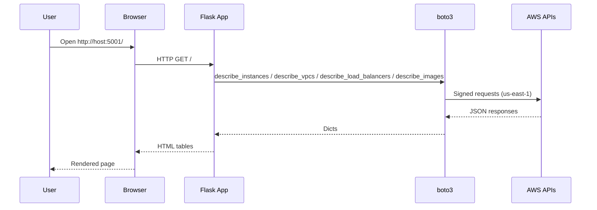
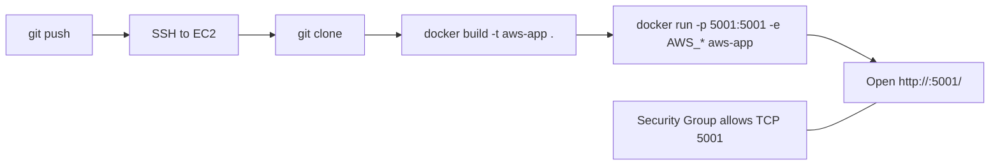
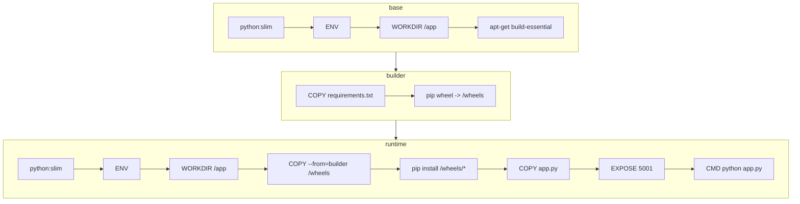

<div align="center">

# AWS Resources Viewer (Flask + Docker + Kubernetes)

A modern Flask application that displays AWS resources (EC2, VPCs, Load Balancers, AMIs) with Kubernetes integration and auto-scaling capabilities. Features real-time pod monitoring, HPA support, and a beautiful responsive UI. Runs on port 5001 with automatic demo mode fallback.

</div>

## Table of Contents
- [Overview](#overview)
- [Features](#features)
- [Project Files](#project-files)
- [Configuration](#configuration)
- [Run Modes](#run-modes)
- [Install & Run](#install--run)
- [Kubernetes Deployment](#kubernetes-deployment)
- [Prebuilt Image (Docker Hub)](#prebuilt-image-docker-hub)
- [EC2 Deployment](#ec2-deployment)
- [Architecture & Diagrams](#architecture--diagrams)
- [Docker Build (Multi-Stage)](#docker-build-multi-stage)
- [Troubleshooting](#troubleshooting)
- [Credits](#credits)

---

## Overview
This application serves a modern, responsive web interface displaying AWS resources across four categories: EC2 Instances, VPCs, Load Balancers, and account-owned AMIs. It features **Kubernetes integration** with real-time pod monitoring and **HPA (Horizontal Pod Autoscaler)** support for dynamic scaling. The app targets region `us-east-1` by default and is designed to run as a lightweight Docker container locally, on EC2, or in a Kubernetes cluster with full GitOps support via ArgoCD.

## Features

### AWS Resources Display
- **EC2 Instances**: state, type, and public IP
- **VPCs**: ID and CIDR blocks
- **Load Balancers** (ALB/NLB): name and DNS
- **AMIs**: account-owned images with IDs and names
- Friendly error handling - page renders even without credentials/permissions

### Kubernetes Integration
- **Real-time Pod Monitoring**: displays active pod count and current pod name
- **Namespace Detection**: shows the Kubernetes namespace the app is running in
- **HPA Support**: designed to work with Horizontal Pod Autoscaler for dynamic scaling
- **Auto-detection**: automatically detects if running in a Kubernetes cluster
- **Graceful Fallback**: works seamlessly outside Kubernetes environments

### Modern UI/UX
- **Responsive Design**: beautiful gradient header with technology logos
- **Live Indicators**: animated status indicators for auto-scaling
- **Technology Stack Display**: shows Kubernetes, HPA, AWS, Flask, and ArgoCD logos
- **Auto-Scaling Dashboard**: dedicated section showing pod count and scaling status
- **Refresh Notice**: clear instructions for viewing updated pod counts
- **Demo Mode Banner**: visual indicator when running without AWS credentials

### DevOps & CI/CD
- **Multi-stage Docker Build**: optimized for size and caching
- **GitOps Ready**: designed for ArgoCD deployment
- **Helm Chart Compatible**: works with Kubernetes Helm deployments
- **Jenkins Integration**: supports CI/CD pipelines
- **Terraform Compatible**: infrastructure as code ready

## Project Files
- `app.py` — Flask application with boto3 AWS calls and Kubernetes client integration
- `Dockerfile` — Multi-stage build: wheels in builder stage, slim runtime
- `requirements.txt` — Dependencies (Flask, boto3, kubernetes)
- `templates/index.html` — Modern responsive HTML template with auto-scaling dashboard
- `static/css/style.css` — Custom styling with gradients and animations
- `static/images/background.png` — Background image assets
- `image.png` — Example screenshot of the rendered page
- `ReadmeHeb.md` — Hebrew version of documentation
- `.dockerignore` — Docker build optimization
- `.gitignore` — Git exclusions

## Configuration

### Environment Variables

**AWS Configuration:**
- `AWS_ACCESS_KEY_ID`, `AWS_SECRET_ACCESS_KEY` — Optional. If no credentials (ENV/Role) are available, the app runs in Demo Mode with sample data
- `AWS_DEFAULT_REGION` — Working region. Defaults to `us-east-1`

**Kubernetes Configuration (Auto-detected):**
- `HOSTNAME` — Pod name (automatically set by Kubernetes)
- `POD_NAMESPACE` — Namespace (automatically set when using downward API)

**Debug/Testing:**
- `SHOW_BUG=1` — Intentionally trigger NameError for testing/demonstration

**Networking:**
- Port `5001/TCP` must be open locally or in your Security Group/Kubernetes Service

## Run Modes

### Demo Mode
When no AWS credentials are detected, the app automatically shows sample data with a yellow banner. Perfect for:
- Testing the application without AWS access
- Demonstrations and presentations
- Development without credentials
- "Runs out-of-the-box" experience

### Real Mode
With valid AWS credentials (EC2 IAM Role or environment variables), the app displays actual AWS resources:
- Live EC2 instances from your account
- Real VPCs and their CIDR blocks
- Active Load Balancers
- Your account's AMIs

### Kubernetes Mode
When running in a Kubernetes cluster, additional features activate:
- Real-time pod count display
- Current pod name and namespace
- Auto-scaling status monitoring
- HPA integration support

### Bug Mode
For testing/demonstration purposes, set `SHOW_BUG=1` to intentionally trigger a NameError (reproduces assignment screenshot).

## Install & Run

### Local Docker Deployment

**Build:**
```bash
docker build -t aws-app .
```

**Run Examples:**

1. **Demo Mode** (no credentials):
```bash
docker run -p 5001:5001 aws-app
```

2. **Real Mode with EC2 IAM Role**:
```bash
docker run -p 5001:5001 aws-app
```

3. **Real Mode with keys** (local testing):
```bash
docker run -p 5001:5001 \
  -e AWS_ACCESS_KEY_ID=YOUR_KEY \
  -e AWS_SECRET_ACCESS_KEY=YOUR_SECRET \
  -e AWS_DEFAULT_REGION=us-east-1 \
  aws-app
```

4. **Bug Mode** (reproduce NameError):
```bash
docker run -p 5001:5001 -e SHOW_BUG=1 aws-app
```

**Note:** On Windows PowerShell use `$Env:VAR` syntax (e.g., `$Env:AWS_ACCESS_KEY_ID`).

**Verify:** Open `http://localhost:5001/` or `http://<EC2_PUBLIC_IP>:5001/`. In Demo Mode, a yellow banner appears at the top.

## Kubernetes Deployment

### Prerequisites
- Kubernetes cluster (local or cloud)
- kubectl configured
- Helm (optional, for Helm chart deployment)
- ArgoCD (optional, for GitOps deployment)

### Basic Kubernetes Deployment

**Create Namespace:**
```bash
kubectl create namespace aws-viewer
```

**Deploy Application:**
```bash
kubectl apply -f k8s/deployment.yaml
kubectl apply -f k8s/service.yaml
```

**With HPA (Horizontal Pod Autoscaler):**
```bash
kubectl apply -f k8s/hpa.yaml
```

### Helm Deployment

```bash
helm install aws-resources-viewer ./helm-chart \
  --namespace aws-viewer \
  --create-namespace
```

### ArgoCD GitOps Deployment

```bash
kubectl apply -f argocd/application.yaml
```

### Accessing the Application

**Port Forward (for testing):**
```bash
kubectl port-forward svc/aws-resources-viewer 5001:5001 -n aws-viewer
```

**Via LoadBalancer/Ingress:**
```bash
kubectl get svc -n aws-viewer
# Access via external IP or LoadBalancer DNS
```

### Monitoring Auto-Scaling

**Watch pod scaling in real-time:**
```bash
kubectl get hpa -n aws-viewer --watch
```

**View pod count:**
```bash
kubectl get pods -n aws-viewer -l app.kubernetes.io/name=aws-resources-viewer
```

**Refresh the web page** to see updated pod count and current pod name.

## Prebuilt Image (Docker Hub)

If you prefer to use a ready-made image from Docker Hub, pull and run it directly.

Pull latest:

```bash
docker pull formy5000/resources_viewer:latest
```

Run examples:

- Demo Mode (no credentials):
```bash
docker run -p 5001:5001 formy5000/resources_viewer:latest
```

- Real Mode with EC2 IAM Role (on an EC2 instance with a role):
```bash
docker run -p 5001:5001 formy5000/resources_viewer:latest
```

- Real Mode with keys (local testing):
```bash
docker run -p 5001:5001 \
  -e AWS_ACCESS_KEY_ID=YOUR_KEY \
  -e AWS_SECRET_ACCESS_KEY=YOUR_SECRET \
  -e AWS_DEFAULT_REGION=us-east-1 \
  YOUR_DOCKERHUB_REPO/your-image:latest
```

## EC2 Deployment

### Manual Deployment
1. **SSH to EC2**: `ssh ec2-user@<EC2_PUBLIC_IP>`
2. **Clone Repository**: `git clone <REPO_URL> && cd <REPO_FOLDER>`
3. **Build & Run**: Follow commands from [Install & Run](#install--run)
4. **Security Group**: Ensure port `5001/TCP` is allowed

### With IAM Role (Recommended)
1. Attach an IAM role to your EC2 instance with permissions:
   - `ec2:Describe*`
   - `elasticloadbalancing:Describe*`
2. Run without credentials - the app will use the instance role automatically

### Terraform Deployment
```bash
cd terraform/
terraform init
terraform plan
terraform apply
```

This will provision:
- EC2 instance with proper IAM role
- Security group with port 5001 open
- Automatic Docker installation and app deployment

## Architecture & Diagrams

Request → Render AWS data (sequence):



Build & Deploy pipeline (GitHub → EC2 → Docker):



## Docker Build (Multi-Stage)

The image is built in three stages to keep the runtime small, fast, and cache‑friendly:

- base: minimal build environment
  - `FROM python:<VERSION>-slim`
  - `ENV` (sane Python defaults)
  - `WORKDIR /app`
  - `apt-get install build-essential` (in case transitive deps need compilation)

- builder: build dependency wheels
  - `COPY requirements.txt .`
  - `pip wheel --no-cache-dir --wheel-dir /wheels -r requirements.txt`

- runtime: lean runtime only
  - `FROM python:<VERSION>-slim`
  - `ENV` + `WORKDIR /app`
  - `COPY --from=builder /wheels /wheels`
  - `pip install --no-cache-dir /wheels/*`
  - `COPY app.py ./`
  - `EXPOSE 5001`
  - `CMD ["python", "app.py"]`

Key benefits:
- Smaller image: no build tools in the runtime layer.
- Faster, reproducible installs: install from local wheels instead of the network.
- Better caching: changing app code doesn’t invalidate dependency layers.

Tip: To change the Python version at build time use `--build-arg PYTHON_VERSION=3.12`.

Mermaid diagram of the build stages:



## Troubleshooting

### AWS Issues
- **Unable to locate credentials**: The app falls back to Demo Mode automatically. If you see this in tables, rebuild with `--no-cache` and start fresh
- **Region**: Set `AWS_DEFAULT_REGION` (defaults to `us-east-1`)
- **Permissions**: Ensure IAM role/keys allow `ec2:Describe*` and `elasticloadbalancing:Describe*`
- **Port/Security Group**: Confirm `5001/TCP` is open from your source network

### Kubernetes Issues
- **Pod count shows 0**: Check if the app has proper RBAC permissions to list pods
- **"Not running in Kubernetes cluster" error**: Normal when running outside K8s
- **Namespace not detected**: Ensure POD_NAMESPACE environment variable is set via downward API
- **HPA not scaling**: Verify metrics-server is installed and HPA is properly configured

### Docker Issues
- **Build fails**: Try `docker build --no-cache -t aws-app .`
- **Container exits immediately**: Check logs with `docker logs <container-id>`
- **Port already in use**: Stop other services on port 5001 or use `-p 5002:5001`

### Testing/Debug
- **Reproduce assignment bug**: Run with `SHOW_BUG=1` to trigger the `vpcs` NameError
- **View logs**: `docker logs -f <container-id>` or `kubectl logs -f <pod-name>`
- **Interactive shell**: `docker exec -it <container-id> /bin/sh`

## Credits

**Author**: Alexander Yasheyev  
**Institution**: JB College  
**Project**: End-to-End CI/CD Pipeline on Kubernetes

**Technologies Used**:
- **Frontend**: Flask, HTML5, CSS3, Jinja2
- **Backend**: Python, boto3, Kubernetes Python Client
- **Infrastructure**: Docker, Kubernetes, Helm
- **CI/CD**: Jenkins, ArgoCD, Terraform
- **Cloud**: AWS (EC2, VPC, ELB, AMI)
- **Orchestration**: Kubernetes with HPA

**Special Features**:
- Multi-stage Docker builds for optimization
- Automatic demo mode fallback
- Real-time Kubernetes pod monitoring
- Horizontal Pod Autoscaler integration
- GitOps-ready with ArgoCD support
- Responsive modern UI with live indicators

---

📚 **Documentation**: Available in English (Readme.md) and Hebrew (ReadmeHeb.md)  
🐳 **Docker Hub**: `formy5000/resources_viewer:latest`  
🔗 **GitHub**: [JB-PROJECT](https://github.com/githuber20202/JB-PROJECT)
