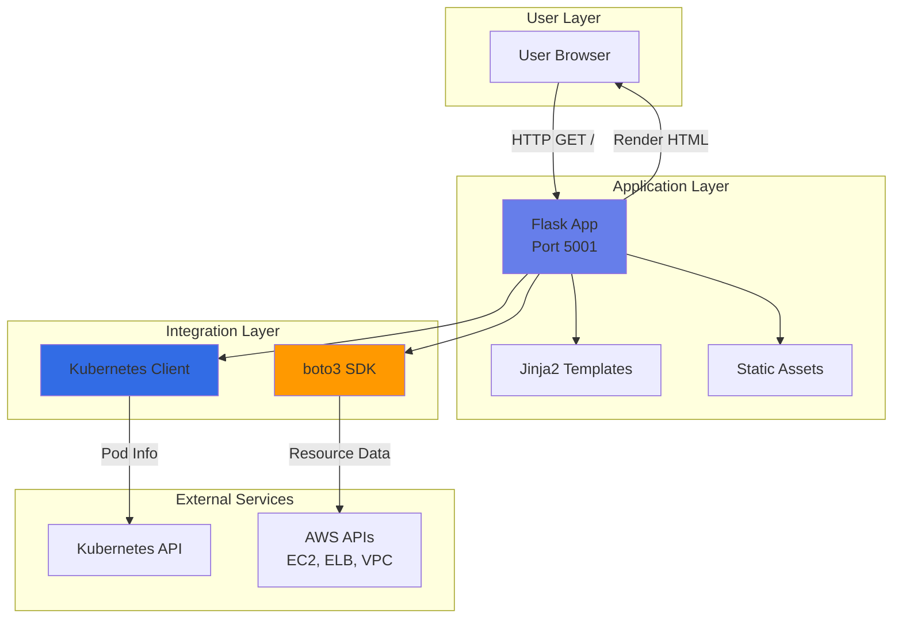
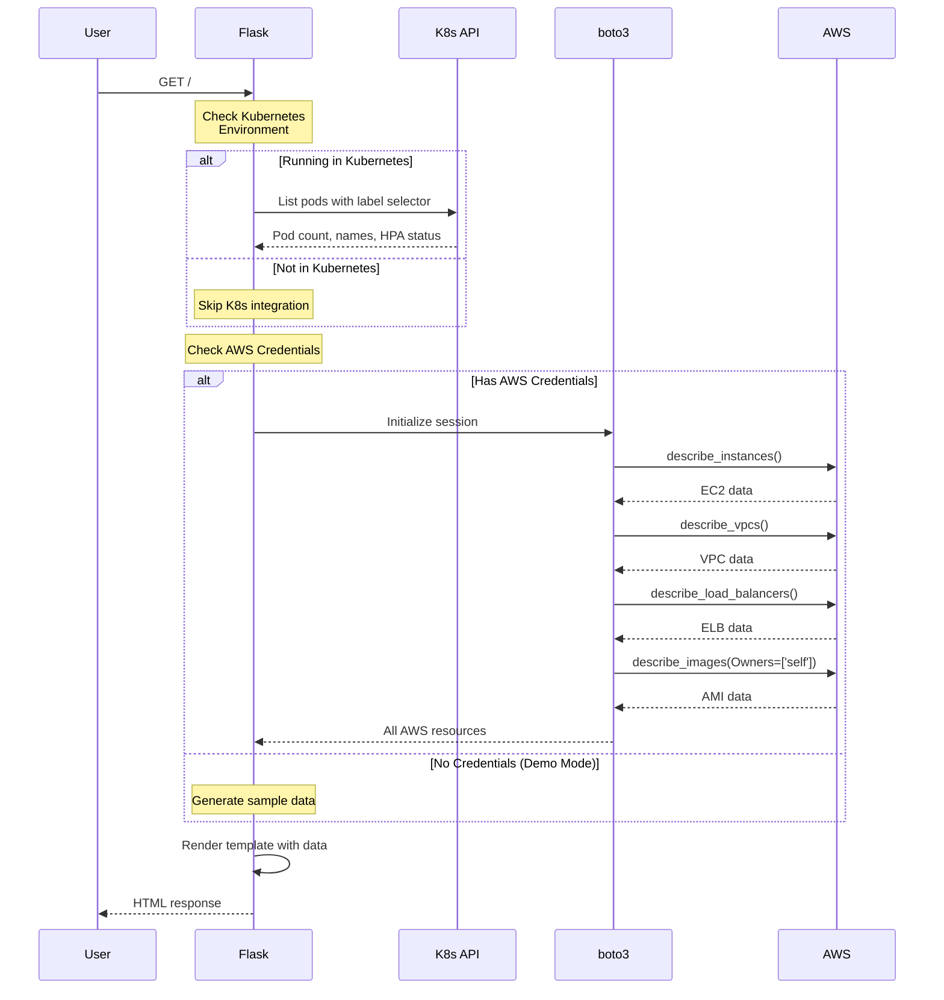
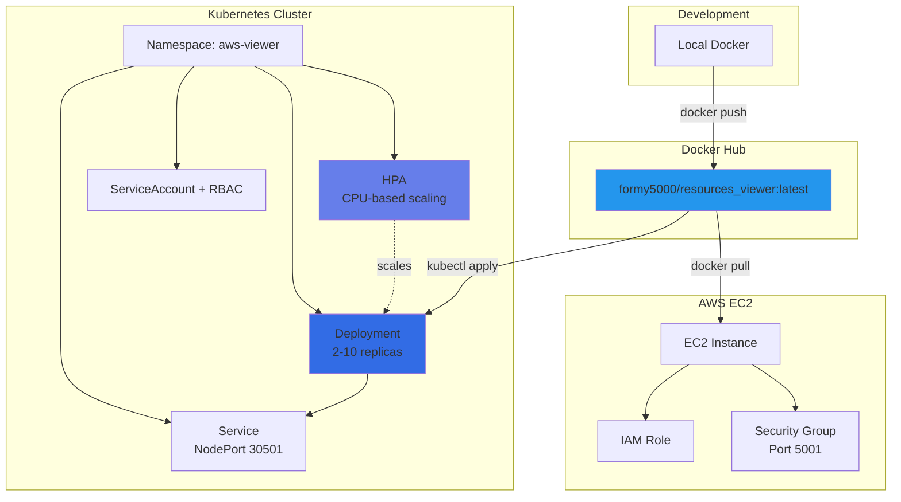
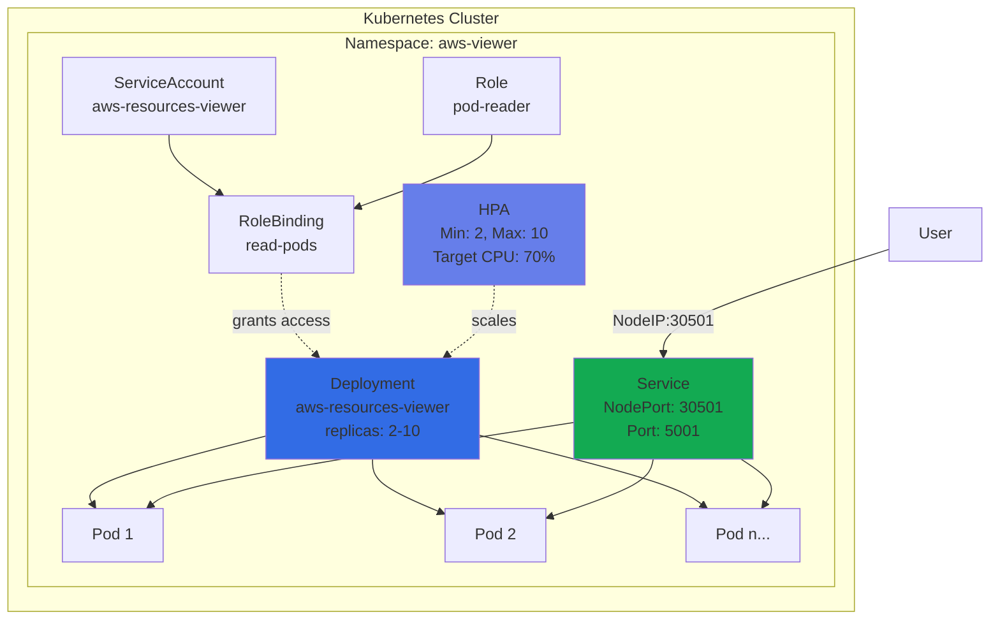
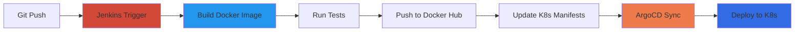
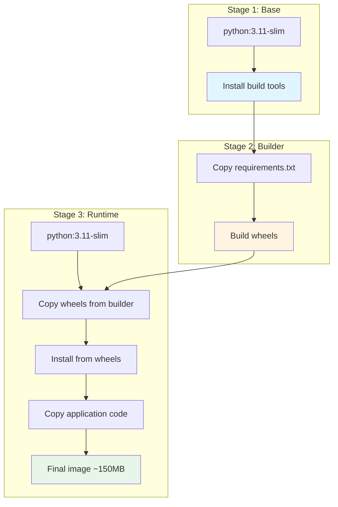

<div align="center">

# AWS Resources Viewer


**Flask-based web application for displaying AWS resources with Kubernetes integration and auto-scaling support**

Part of the End-to-End CI/CD Pipeline on Kubernetes project

[Quick Start](#-quick-start) • [Features](#-features) • [Architecture](#-architecture) • [Installation](#-installation) • [Deployment](#-deployment)

</div>

---

## 📋 Table of Contents

- [Overview](#-overview)
- [Features](#-features)
- [Architecture](#-architecture)
- [Project Structure](#-project-structure)
- [Prerequisites](#-prerequisites)
- [Quick Start](#-quick-start)
- [Installation](#-installation)
  - [Local Docker](#local-docker)
  - [Docker Hub](#docker-hub)
- [Deployment](#-deployment)
  - [EC2 Deployment](#ec2-deployment)
  - [Kubernetes Deployment](#kubernetes-deployment)
- [Configuration](#-configuration)
- [Monitoring](#-monitoring)
- [Troubleshooting](#-troubleshooting)
- [CI/CD Integration](#-cicd-integration)

---

## 🎯 Overview

This application is a **demonstration component** of a comprehensive CI/CD pipeline project. It serves as the application layer that showcases:

- **AWS Resource Visualization**: Displays EC2 instances, VPCs, Load Balancers (ELB/ALB/NLB), and AMIs
- **Kubernetes Integration**: Real-time pod monitoring and auto-scaling capabilities
- **Cloud-Native Design**: Built for containerized deployment with HPA support
- **Demo Mode**: Runs without AWS credentials for testing and demonstrations

### Project Context

This application is part of a larger **End-to-End CI/CD Pipeline** that includes:
- **Source Control**: Git/GitHub
- **CI/CD Orchestration**: Jenkins
- **Containerization**: Docker
- **Container Registry**: Docker Hub
- **Orchestration**: Kubernetes
- **GitOps**: ArgoCD
- **Infrastructure as Code**: Terraform (for AWS resources)
- **Package Management**: Helm

> **Note**: This README focuses on the application component. For the complete CI/CD pipeline documentation, refer to the main project repository.

---

## ✨ Features

### AWS Resources Display
- **EC2 Instances**: Instance ID, state, type, and public IP
- **VPCs**: VPC ID and CIDR blocks
- **Load Balancers**: AWS ELB/ALB/NLB names and DNS endpoints
- **AMIs**: Account-owned Amazon Machine Images
- **Automatic Demo Mode**: Displays sample data when AWS credentials are unavailable

### Kubernetes Integration
- **Pod Monitoring**: Real-time pod count and current pod name display
- **Namespace Detection**: Automatic namespace identification
- **HPA Support**: Horizontal Pod Autoscaler integration with metrics display
- **Service Information**: Service type and port configuration
- **Resource Monitoring**: CPU and memory limits/requests visibility
- **Auto-Detection**: Seamless operation in and out of Kubernetes environments

### Modern UI/UX
- **Responsive Design**: Mobile-friendly interface with gradient styling
- **Live Indicators**: Animated status indicators for auto-scaling
- **Technology Stack Display**: Visual representation of integrated technologies
- **Real-Time Updates**: Manual refresh to view updated metrics
- **Demo Mode Banner**: Clear visual indicator when running without credentials

### DevOps Features
- **Multi-Stage Docker Build**: Optimized image size with layer caching
- **Zero-Configuration Demo**: Runs immediately without setup
- **Container-Ready**: Lightweight Docker image (~150MB)
- **Cloud-Native**: Designed for Kubernetes deployment
- **CI/CD Friendly**: Easy integration with automation pipelines

---

## 🏗 Architecture

### Application Flow



### Request Processing Flow



### Deployment Architecture



---

## 📁 Project Structure

```
JB-PROJECT/
├── app.py                      # Flask application with AWS and K8s integration
├── Dockerfile                  # Multi-stage Docker build configuration
├── requirements.txt            # Python dependencies (Flask, boto3, kubernetes)
├── templates/
│   └── index.html             # Responsive HTML template with Jinja2
├── static/
│   ├── css/
│   │   └── style.css          # Custom styling with gradients and animations
│   └── images/
│       └── background.png     # Background image assets
├── Readme.md                   # This documentation
├── .dockerignore              # Docker build optimization
└── .gitignore                 # Git exclusions
```

### Key Files

| File | Purpose | Key Features |
|------|---------|--------------|
| `app.py` | Main application | boto3 integration, K8s client, demo mode, error handling |
| `Dockerfile` | Container build | Multi-stage build, Python 3.11, optimized layers |
| `requirements.txt` | Dependencies | Flask 3.0+, boto3 1.28+, kubernetes 28.0+ |
| `templates/index.html` | UI template | Responsive design, K8s metrics, AWS resource tables |
| `static/css/style.css` | Styling | Gradient header, animations, modern UI |

---

## 🔧 Prerequisites

### Required
- **Docker**: Version 20.10 or higher
- **Python**: 3.11 (for local development)

### Optional
- **AWS Account**: For displaying real AWS resources
- **AWS Credentials**: Access key/secret or IAM role
- **Kubernetes Cluster**: For K8s features and auto-scaling
- **kubectl**: For Kubernetes deployment

---

## 🚀 Quick Start

### Instant Demo (No Setup Required)

```bash
docker run -p 5001:5001 formy5000/resources_viewer:latest
```

Open **http://localhost:5001** - The application runs in demo mode with sample data!

### With AWS Credentials

```bash
docker run -p 5001:5001 \
  -e AWS_ACCESS_KEY_ID=YOUR_KEY \
  -e AWS_SECRET_ACCESS_KEY=YOUR_SECRET \
  -e AWS_DEFAULT_REGION=us-east-1 \
  formy5000/resources_viewer:latest
```

---

## 💻 Installation

### Local Docker

**1. Clone the repository:**
```bash
git clone https://github.com/githuber20202/JB-PROJECT.git
cd JB-PROJECT
```

**2. Build the Docker image:**
```bash
docker build -t aws-resources-viewer .
```

**3. Run the container:**

**Demo Mode** (no credentials needed):
```bash
docker run -p 5001:5001 aws-resources-viewer
```

**With AWS credentials**:
```bash
docker run -p 5001:5001 \
  -e AWS_ACCESS_KEY_ID=YOUR_KEY \
  -e AWS_SECRET_ACCESS_KEY=YOUR_SECRET \
  -e AWS_DEFAULT_REGION=us-east-1 \
  aws-resources-viewer
```

**4. Access the application:**
```
http://localhost:5001
```

### Docker Hub

**Pull the pre-built image:**
```bash
docker pull formy5000/resources_viewer:latest
```

**Run directly:**
```bash
# Demo mode
docker run -p 5001:5001 formy5000/resources_viewer:latest

# With AWS credentials
docker run -p 5001:5001 \
  -e AWS_ACCESS_KEY_ID=YOUR_KEY \
  -e AWS_SECRET_ACCESS_KEY=YOUR_SECRET \
  -e AWS_DEFAULT_REGION=us-east-1 \
  formy5000/resources_viewer:latest
```

---

## 🌐 Deployment

### EC2 Deployment

#### Prerequisites
- EC2 instance (Amazon Linux 2 or Ubuntu)
- Security Group with port 5001 open
- (Optional) IAM role with EC2/ELB read permissions

#### Installation Steps

**1. Connect to your EC2 instance:**
```bash
ssh ec2-user@YOUR_EC2_PUBLIC_IP
```

**2. Install Docker:**

**Amazon Linux 2:**
```bash
sudo yum update -y
sudo yum install docker -y
sudo service docker start
sudo usermod -a -G docker ec2-user
```

**Ubuntu:**
```bash
sudo apt-get update
sudo apt-get install docker.io -y
sudo systemctl start docker
sudo usermod -a -G docker ubuntu
```

**3. Pull and run the application:**
```bash
docker pull formy5000/resources_viewer:latest
docker run -d -p 5001:5001 --name aws-viewer formy5000/resources_viewer:latest
```

**4. Configure Security Group:**
- Add inbound rule: **TCP port 5001** from your IP or 0.0.0.0/0

**5. Access the application:**
```
http://YOUR_EC2_PUBLIC_IP:5001
```

#### Using IAM Role (Recommended)

**1. Create IAM role with policy:**
```json
{
  "Version": "2012-10-17",
  "Statement": [
    {
      "Effect": "Allow",
      "Action": [
        "ec2:DescribeInstances",
        "ec2:DescribeVpcs",
        "ec2:DescribeImages",
        "elasticloadbalancing:DescribeLoadBalancers"
      ],
      "Resource": "*"
    }
  ]
}
```

**2. Attach role to EC2 instance**

**3. Run container** - credentials are automatically provided:
```bash
docker run -d -p 5001:5001 --name aws-viewer formy5000/resources_viewer:latest
```

### Kubernetes Deployment

#### Architecture Overview



#### Deployment Manifests

**Namespace:**
```yaml
apiVersion: v1
kind: Namespace
metadata:
  name: aws-viewer
```

**ServiceAccount & RBAC:**
```yaml
apiVersion: v1
kind: ServiceAccount
metadata:
  name: aws-resources-viewer
  namespace: aws-viewer
---
apiVersion: rbac.authorization.k8s.io/v1
kind: Role
metadata:
  name: pod-reader
  namespace: aws-viewer
rules:
- apiGroups: [""]
  resources: ["pods"]
  verbs: ["get", "list"]
---
apiVersion: rbac.authorization.k8s.io/v1
kind: RoleBinding
metadata:
  name: read-pods
  namespace: aws-viewer
subjects:
- kind: ServiceAccount
  name: aws-resources-viewer
  namespace: aws-viewer
roleRef:
  kind: Role
  name: pod-reader
  apiGroup: rbac.authorization.k8s.io
```

**Deployment:**
```yaml
apiVersion: apps/v1
kind: Deployment
metadata:
  name: aws-resources-viewer
  namespace: aws-viewer
  labels:
    app.kubernetes.io/name: aws-resources-viewer
spec:
  replicas: 2
  selector:
    matchLabels:
      app.kubernetes.io/name: aws-resources-viewer
  template:
    metadata:
      labels:
        app.kubernetes.io/name: aws-resources-viewer
    spec:
      serviceAccountName: aws-resources-viewer
      containers:
      - name: app
        image: formy5000/resources_viewer:latest
        ports:
        - containerPort: 5001
          name: http
        env:
        - name: POD_NAMESPACE
          valueFrom:
            fieldRef:
              fieldPath: metadata.namespace
        - name: AWS_DEFAULT_REGION
          value: "us-east-1"
        resources:
          requests:
            cpu: 100m
            memory: 128Mi
          limits:
            cpu: 500m
            memory: 512Mi
```

**Service:**
```yaml
apiVersion: v1
kind: Service
metadata:
  name: aws-resources-viewer
  namespace: aws-viewer
spec:
  type: NodePort
  selector:
    app.kubernetes.io/name: aws-resources-viewer
  ports:
  - port: 5001
    targetPort: 5001
    nodePort: 30501
    protocol: TCP
    name: http
```

**HPA (Horizontal Pod Autoscaler):**
```yaml
apiVersion: autoscaling/v2
kind: HorizontalPodAutoscaler
metadata:
  name: aws-resources-viewer-hpa
  namespace: aws-viewer
spec:
  scaleTargetRef:
    apiVersion: apps/v1
    kind: Deployment
    name: aws-resources-viewer
  minReplicas: 2
  maxReplicas: 10
  metrics:
  - type: Resource
    resource:
      name: cpu
      target:
        type: Utilization
        averageUtilization: 70
```

#### Deployment Commands

**1. Create namespace:**
```bash
kubectl create namespace aws-viewer
```

**2. Apply all manifests:**
```bash
kubectl apply -f namespace.yaml
kubectl apply -f rbac.yaml
kubectl apply -f deployment.yaml
kubectl apply -f service.yaml
kubectl apply -f hpa.yaml
```

**3. Verify deployment:**
```bash
# Check pods
kubectl get pods -n aws-viewer -l app.kubernetes.io/name=aws-resources-viewer

# Check service
kubectl get svc -n aws-viewer

# Check HPA
kubectl get hpa -n aws-viewer
```

**4. Access the application:**

**Via NodePort:**
```bash
# Get node IP
kubectl get nodes -o wide

# Access via browser
http://NODE_IP:30501
```

**Via Port Forward (for testing):**
```bash
kubectl port-forward svc/aws-resources-viewer 5001:5001 -n aws-viewer
# Access: http://localhost:5001
```

---

## ⚙️ Configuration

### Environment Variables

| Variable | Required | Default | Description |
|----------|----------|---------|-------------|
| `AWS_ACCESS_KEY_ID` | No | - | AWS access key (optional if using IAM role) |
| `AWS_SECRET_ACCESS_KEY` | No | - | AWS secret key (optional if using IAM role) |
| `AWS_DEFAULT_REGION` | No | `us-east-1` | AWS region for resource queries |
| `HOSTNAME` | Auto | - | Pod name (automatically set by Kubernetes) |
| `POD_NAMESPACE` | Auto | `default` | Namespace (set via downward API in K8s) |
| `SHOW_BUG` | No | - | Set to `1` to trigger intentional error (for testing) |

### Application Modes

#### Demo Mode
- **Trigger**: No AWS credentials detected
- **Behavior**: Displays sample data with yellow banner
- **Use Cases**: Testing, demonstrations, development without AWS access
- **Sample Data**:
  - 1 EC2 instance (i-0demo123)
  - 1 VPC (vpc-0demo123)
  - 1 Load Balancer (alb-demo)
  - 1 AMI (ami-0demo123)

#### Real Mode
- **Trigger**: Valid AWS credentials present
- **Behavior**: Queries actual AWS resources
- **Requirements**: IAM permissions for EC2 and ELB describe operations

#### Kubernetes Mode
- **Trigger**: Running inside Kubernetes cluster
- **Behavior**: Displays pod count, HPA status, service info
- **Requirements**: ServiceAccount with pod read permissions

---

## 📊 Monitoring

### Kubernetes Monitoring

**Watch HPA in real-time:**
```bash
kubectl get hpa -n aws-viewer --watch
```

**Monitor pod scaling:**
```bash
kubectl get pods -n aws-viewer -l app.kubernetes.io/name=aws-resources-viewer --watch
```

**View pod logs:**
```bash
kubectl logs -f deployment/aws-resources-viewer -n aws-viewer
```

**Check resource usage:**
```bash
kubectl top pods -n aws-viewer
```

### Application Metrics

The web interface displays:
- **Active Pods**: Current number of running pods
- **Current Pod**: Name of the pod serving the request
- **Namespace**: Kubernetes namespace
- **HPA Status**: Min/max replicas, current/desired replicas, target CPU
- **Service Info**: Service type and ports
- **Resource Limits**: CPU and memory limits/requests

**Refresh the page (F5)** to see updated metrics.

---

## 🔍 Troubleshooting

### Common Issues

#### AWS Connection Issues

**Problem**: "Unable to locate credentials"
- **Solution**: This is normal! Application runs in demo mode
- **For real data**: Provide credentials via environment variables or IAM role

**Problem**: Wrong region data displayed
- **Solution**: Set `AWS_DEFAULT_REGION` environment variable
- **Default**: `us-east-1`

**Problem**: Permission denied errors
- **Solution**: Ensure IAM role/keys have required permissions:
  ```json
  {
    "Effect": "Allow",
    "Action": [
      "ec2:DescribeInstances",
      "ec2:DescribeVpcs",
      "ec2:DescribeImages",
      "elasticloadbalancing:DescribeLoadBalancers"
    ],
    "Resource": "*"
  }
  ```

#### Kubernetes Issues

**Problem**: Pod count shows 0
- **Solution**: 
  - Check RBAC permissions: `kubectl describe role pod-reader -n aws-viewer`
  - Verify label selector matches: `app.kubernetes.io/name=aws-resources-viewer`
  - Check ServiceAccount binding: `kubectl describe rolebinding read-pods -n aws-viewer`

**Problem**: "Not running in Kubernetes cluster" error
- **Solution**: This is normal when running outside K8s (local Docker)
- Application works fine without K8s features

**Problem**: HPA not scaling
- **Solution**:
  - Verify metrics-server: `kubectl get deployment metrics-server -n kube-system`
  - Check HPA status: `kubectl describe hpa aws-resources-viewer-hpa -n aws-viewer`
  - Ensure resource requests are set in deployment

**Problem**: Namespace not detected
- **Solution**: Set `POD_NAMESPACE` via downward API in deployment manifest

#### Docker Issues

**Problem**: Container exits immediately
- **Solution**: 
  - Check logs: `docker logs <container-id>`
  - Verify port 5001 is not in use: `netstat -an | grep 5001`

**Problem**: Cannot access application
- **Solution**:
  - Verify container is running: `docker ps`
  - Check port mapping: `docker port <container-id>`
  - Ensure firewall allows port 5001

### Debug Mode

**Reproduce intentional error (for testing):**
```bash
docker run -p 5001:5001 -e SHOW_BUG=1 formy5000/resources_viewer:latest
```

**View container logs:**
```bash
# Docker
docker logs -f <container-id>

# Kubernetes
kubectl logs -f <pod-name> -n aws-viewer
```

**Interactive shell:**
```bash
# Docker
docker exec -it <container-id> /bin/sh

# Kubernetes
kubectl exec -it <pod-name> -n aws-viewer -- /bin/sh
```

---

## 🔄 CI/CD Integration

This application is designed to integrate seamlessly with CI/CD pipelines:

### Pipeline Flow



### Integration Points

1. **Source Control**: Git repository with application code
2. **CI Server**: Jenkins builds Docker image on commit
3. **Container Registry**: Docker Hub stores versioned images
4. **GitOps**: ArgoCD monitors manifest repository
5. **Orchestration**: Kubernetes deploys and scales application
6. **Monitoring**: HPA automatically scales based on load

### Docker Build Optimization

The Dockerfile uses a **multi-stage build** for optimal image size and build caching:



**Benefits**:
- ✅ Smaller runtime image (no build tools)
- ✅ Faster dependency installation (pre-built wheels)
- ✅ Better layer caching (dependencies separate from code)
- ✅ Reproducible builds

---

## 👨‍💻 Credits

**Author**: Alexander Yasheyev  
**Institution**: JB College  
**Project**: End-to-End CI/CD Pipeline on Kubernetes

### Technology Stack

**Application**:
- Python 3.11
- Flask 3.0
- boto3 (AWS SDK)
- Kubernetes Python Client

**Infrastructure**:
- Docker (Multi-stage builds)
- Kubernetes
- AWS (EC2, VPC, ELB, AMI)

**CI/CD Tools**:
- Jenkins
- Docker Hub
- ArgoCD
- Helm
- Terraform

---

<div align="center">

**🐳 Docker Hub**: [`formy5000/resources_viewer:latest`](https://hub.docker.com/r/formy5000/resources_viewer)  
**🔗 GitHub**: [JB-PROJECT](https://github.com/githuber20202/JB-PROJECT)

---

**Part of End-to-End CI/CD Pipeline on Kubernetes**

Made with ❤️ for JB College

</div>
