<div align="center">

# AWS Resources Viewer


A modern Flask application that **displays AWS resources** (EC2, VPCs, **AWS Elastic Load Balancers**, AMIs) with built-in Kubernetes integration and auto-scaling support. Features real-time pod monitoring, automatic demo mode fallback, and a beautiful responsive UI.

**Important:** This application **displays** AWS Load Balancers (ELB/ALB/NLB) from your AWS account. It does **not** require or use a Kubernetes LoadBalancer Service to run.

[Quick Start](#-quick-start) • [Features](#features) • [Installation](#install--run) • [Docker Hub](#prebuilt-image-docker-hub) • [Documentation](#table-of-contents)

</div>

##  Quick Start

**Run instantly with Docker (no AWS credentials needed):**

```bash
docker run -p 5001:5001 formy5000/resources_viewer:latest
```

Open **http://localhost:5001** - runs in demo mode with sample data!

**With AWS credentials:**

```bash
docker run -p 5001:5001 \
  -e AWS_ACCESS_KEY_ID=YOUR_KEY \
  -e AWS_SECRET_ACCESS_KEY=YOUR_SECRET \
  -e AWS_DEFAULT_REGION=us-east-1 \
  formy5000/resources_viewer:latest
```

---

## Table of Contents
- [Overview](#overview)
- [Features](#features)
- [Project Files](#project-files)
- [Configuration](#configuration)
- [Run Modes](#run-modes)
- [Install & Run](#install--run)
- [Prebuilt Image (Docker Hub)](#prebuilt-image-docker-hub)
- [EC2 Deployment](#ec2-deployment)
- [Kubernetes Integration](#kubernetes-integration)
- [Architecture & Diagrams](#architecture--diagrams)
- [Docker Build (Multi-Stage)](#docker-build-multi-stage)
- [Troubleshooting](#troubleshooting)
- [Credits](#credits)

---

## Overview

This application serves a modern, responsive web interface displaying AWS resources across four categories: **EC2 Instances**, **VPCs**, **Load Balancers (ELB/ALB)**, and **account-owned AMIs**. 

> **Note:** "Load Balancers" refers to AWS Elastic Load Balancers (ELB/ALB/NLB) that the application displays, not Kubernetes LoadBalancer Service type.

The app features **built-in Kubernetes support** with real-time pod monitoring and is designed to work with **HPA (Horizontal Pod Autoscaler)** for dynamic scaling. It targets region `us-east-1` by default and runs as a lightweight Docker container locally, on EC2, or in a Kubernetes cluster.

**Key Highlight:** Automatic demo mode - runs out-of-the-box without AWS credentials!

---

## Features

### 🔍 AWS Resources Display
- **EC2 Instances**: state, type, and public IP
- **VPCs**: ID and CIDR blocks
- **AWS Load Balancers (ELB/ALB/NLB)**: displays your account's load balancers with name and DNS
- **AMIs**: account-owned images with IDs and names
- **Friendly error handling**: page renders even without credentials/permissions

> **Clarification:** This feature displays AWS Elastic Load Balancers from your AWS account, not Kubernetes LoadBalancer Services.

### ☸️ Kubernetes Integration
- **Real-time Pod Monitoring**: displays active pod count and current pod name
- **Namespace Detection**: shows the Kubernetes namespace the app is running in
- **HPA Support**: designed to work with Horizontal Pod Autoscaler for dynamic scaling
  - Displays HPA status (min/max replicas, current replicas)
  - Shows target CPU utilization percentage
  - Real-time scaling metrics
- **Service Information**: displays service type (NodePort/ClusterIP) and ports
- **Resource Monitoring**: shows pod resource limits and requests (CPU, Memory)
- **Auto-detection**: automatically detects if running in a Kubernetes cluster
- **Graceful Fallback**: works seamlessly outside Kubernetes environments

### 🎨 Modern UI/UX
- **Responsive Design**: beautiful gradient header with technology logos
- **Live Indicators**: animated status indicators for auto-scaling
- **Technology Stack Display**: shows Kubernetes, HPA, AWS, Flask, and ArgoCD logos
- **Auto-Scaling Dashboard**: dedicated section showing pod count and scaling status
- **Refresh Notice**: clear instructions for viewing updated pod counts
- **Demo Mode Banner**: visual indicator when running without AWS credentials

### 🚀 DevOps Ready
- **Multi-stage Docker Build**: optimized for size and caching
- **Demo Mode**: runs without AWS credentials for testing/demos
- **Container-ready**: lightweight Docker image
- **Cloud-native**: designed for Kubernetes deployment
- **CI/CD friendly**: easy integration with Jenkins, GitOps tools

---

## Project Files

```
JB-PROJECT/
├── app.py                      # Flask application with boto3 and Kubernetes client
├── Dockerfile                  # Multi-stage build for optimized image
├── requirements.txt            # Python dependencies (Flask, boto3, kubernetes)
├── templates/
│   └── index.html             # Modern responsive HTML template
├── static/
│   ├── css/
│   │   └── style.css          # Custom styling with gradients and animations
│   └── images/
│       └── background.png     # Background image assets
├── image.png                   # Application screenshot
├── Readme.md                   # This file
├── .dockerignore              # Docker build optimization
└── .gitignore                 # Git exclusions
```

---

## Configuration

### Environment Variables

**AWS Configuration:**
- `AWS_ACCESS_KEY_ID`, `AWS_SECRET_ACCESS_KEY` — Optional. If not provided, app runs in **Demo Mode** with sample data
- `AWS_DEFAULT_REGION` — Working region. Defaults to `us-east-1`

**Kubernetes Configuration (Auto-detected):**
- `HOSTNAME` — Pod name (automatically set by Kubernetes)
- `POD_NAMESPACE` — Namespace (automatically set when using downward API)

**Debug/Testing:**
- `SHOW_BUG=1` — Intentionally trigger NameError for testing/demonstration

**Networking:**
- Port `5001/TCP` must be open locally or in your Security Group/Kubernetes Service

---

## Run Modes

### 🎭 Demo Mode
When no AWS credentials are detected, the app automatically shows sample data with a yellow banner. Perfect for:
- Testing the application without AWS access
- Demonstrations and presentations
- Development without credentials
- "Runs out-of-the-box" experience

**Sample data includes:**
- 1 EC2 instance (i-0demo123)
- 1 VPC (vpc-0demo123)
- 1 Load Balancer (alb-demo)
- 1 AMI (ami-0demo123)

### ☁️ Real Mode
With valid AWS credentials (EC2 IAM Role or environment variables), the app displays actual AWS resources:
- Live EC2 instances from your account
- Real VPCs and their CIDR blocks
- Active AWS Load Balancers (ELB/ALB/NLB)
- Your account's AMIs

### ☸️ Kubernetes Mode
When running in a Kubernetes cluster, additional features activate:
- Real-time pod count display
- Current pod name and namespace
- Auto-scaling status monitoring
- HPA integration support

### 🐛 Bug Mode
For testing/demonstration purposes, set `SHOW_BUG=1` to intentionally trigger a NameError.

---

## Install & Run

### Prerequisites
- Docker installed on your machine
- (Optional) AWS credentials for real data
- (Optional) Kubernetes cluster for K8s features

### Local Docker Deployment

**1. Clone the repository:**
```bash
git clone https://github.com/githuber20202/JB-PROJECT.git
cd JB-PROJECT
```

**2. Build the image:**
```bash
docker build -t aws-app .
```

**3. Run the container:**

**Demo Mode** (no credentials):
```bash
docker run -p 5001:5001 aws-app
```

**Real Mode with EC2 IAM Role** (on EC2 instance):
```bash
docker run -p 5001:5001 aws-app
```

**Real Mode with keys** (local testing):
```bash
docker run -p 5001:5001 \
  -e AWS_ACCESS_KEY_ID=YOUR_KEY \
  -e AWS_SECRET_ACCESS_KEY=YOUR_SECRET \
  -e AWS_DEFAULT_REGION=us-east-1 \
  aws-app
```

**Bug Mode** (reproduce NameError):
```bash
docker run -p 5001:5001 -e SHOW_BUG=1 aws-app
```

**4. Access the application:**

Open your browser to:
- **Local:** http://localhost:5001
- **EC2:** http://YOUR_EC2_PUBLIC_IP:5001

> **Note:** On Windows PowerShell, use `$Env:VAR` syntax (e.g., `$Env:AWS_ACCESS_KEY_ID="YOUR_KEY"`).

---

## Prebuilt Image (Docker Hub)

Pull and run the ready-made image directly from Docker Hub:

**Pull latest:**
```bash
docker pull formy5000/resources_viewer:latest
```

**Run examples:**

**Demo Mode** (no credentials):
```bash
docker run -p 5001:5001 formy5000/resources_viewer:latest
```

**Real Mode with EC2 IAM Role** (on EC2 instance):
```bash
docker run -p 5001:5001 formy5000/resources_viewer:latest
```

**Real Mode with keys** (local testing):
```bash
docker run -p 5001:5001 \
  -e AWS_ACCESS_KEY_ID=YOUR_KEY \
  -e AWS_SECRET_ACCESS_KEY=YOUR_SECRET \
  -e AWS_DEFAULT_REGION=us-east-1 \
  formy5000/resources_viewer:latest
```

---

## EC2 Deployment

### Manual Deployment

**1. Launch an EC2 instance** (Amazon Linux 2 or Ubuntu)

**2. SSH to your instance:**
```bash
ssh ec2-user@YOUR_EC2_PUBLIC_IP
```

**3. Install Docker:**
```bash
# Amazon Linux 2
sudo yum update -y
sudo yum install docker -y
sudo service docker start
sudo usermod -a -G docker ec2-user

# Ubuntu
sudo apt-get update
sudo apt-get install docker.io -y
sudo systemctl start docker
sudo usermod -a -G docker ubuntu
```

**4. Pull and run the application:**
```bash
docker pull formy5000/resources_viewer:latest
docker run -d -p 5001:5001 --name aws-viewer formy5000/resources_viewer:latest
```

**5. Configure Security Group:**
- Add inbound rule: **TCP port 5001** from your IP

**6. Access the application:**
```
http://YOUR_EC2_PUBLIC_IP:5001
```

### With IAM Role (Recommended)

**1. Create IAM Role** with permissions:
```json
{
  "Version": "2012-10-17",
  "Statement": [
    {
      "Effect": "Allow",
      "Action": [
        "ec2:Describe*",
        "elasticloadbalancing:Describe*"
      ],
      "Resource": "*"
    }
  ]
}
```

**2. Attach the role** to your EC2 instance

**3. Run the container** - it will automatically use the instance role:
```bash
docker run -d -p 5001:5001 --name aws-viewer formy5000/resources_viewer:latest
```

No credentials needed! The app will fetch real AWS data using the IAM role.

---

## Kubernetes Integration

The application includes **built-in Kubernetes support** that automatically activates when running in a K8s cluster.

### Features

- **Auto-detection**: Detects if running inside Kubernetes
- **Pod Monitoring**: Shows real-time pod count and current pod name
- **Namespace Awareness**: Displays the namespace the app is running in
- **HPA Ready**: Designed to work with Horizontal Pod Autoscaler
- **Graceful Fallback**: Works normally outside K8s environments

### How It Works

The Python code uses the `kubernetes` client library to:
1. Detect if running in a cluster (via `load_incluster_config()`)
2. Query the Kubernetes API for pods with label `app.kubernetes.io/name=aws-resources-viewer`
3. Count running pods and display current pod information
4. Update the UI with real-time scaling status

### Deploying to Kubernetes

To deploy this application on Kubernetes, you'll need to create your own manifests. Here's a basic example:

**Deployment:**
```yaml
apiVersion: apps/v1
kind: Deployment
metadata:
  name: aws-resources-viewer
  namespace: aws-viewer
spec:
  replicas: 2
  selector:
    matchLabels:
      app.kubernetes.io/name: aws-resources-viewer
  template:
    metadata:
      labels:
        app.kubernetes.io/name: aws-resources-viewer
    spec:
      serviceAccountName: aws-resources-viewer
      containers:
      - name: app
        image: formy5000/resources_viewer:latest
        ports:
        - containerPort: 5001
        env:
        - name: POD_NAMESPACE
          valueFrom:
            fieldRef:
              fieldPath: metadata.namespace
        - name: AWS_DEFAULT_REGION
          value: "us-east-1"
```

**Service:**
```yaml
apiVersion: v1
kind: Service
metadata:
  name: aws-resources-viewer
  namespace: aws-viewer
spec:
  type: NodePort
  ports:
  - port: 5001
    targetPort: 5001
    nodePort: 30501
  selector:
    app.kubernetes.io/name: aws-resources-viewer
```

**ServiceAccount & RBAC:**
```yaml
apiVersion: v1
kind: ServiceAccount
metadata:
  name: aws-resources-viewer
  namespace: aws-viewer
---
apiVersion: rbac.authorization.k8s.io/v1
kind: Role
metadata:
  name: pod-reader
  namespace: aws-viewer
rules:
- apiGroups: [""]
  resources: ["pods"]
  verbs: ["get", "list"]
---
apiVersion: rbac.authorization.k8s.io/v1
kind: RoleBinding
metadata:
  name: read-pods
  namespace: aws-viewer
subjects:
- kind: ServiceAccount
  name: aws-resources-viewer
roleRef:
  kind: Role
  name: pod-reader
  apiGroup: rbac.authorization.k8s.io
```

**HPA (Horizontal Pod Autoscaler):**
```yaml
apiVersion: autoscaling/v2
kind: HorizontalPodAutoscaler
metadata:
  name: aws-resources-viewer-hpa
  namespace: aws-viewer
spec:
  scaleTargetRef:
    apiVersion: apps/v1
    kind: Deployment
    name: aws-resources-viewer
  minReplicas: 2
  maxReplicas: 10
  metrics:
  - type: Resource
    resource:
      name: cpu
      target:
        type: Utilization
        averageUtilization: 70
```

### Accessing the Application

**Port Forward (for testing):**
```bash
kubectl port-forward svc/aws-resources-viewer 5001:5001 -n aws-viewer
```

**Via NodePort:**
```bash
kubectl get svc aws-resources-viewer -n aws-viewer
# Access via NODE-IP:30501
```

### Monitoring Auto-Scaling

**Watch HPA in real-time:**
```bash
kubectl get hpa -n aws-viewer --watch
```

**View pod count:**
```bash
kubectl get pods -n aws-viewer -l app.kubernetes.io/name=aws-resources-viewer
```

**Refresh the web page** to see updated pod count and current pod name!

---

## Architecture & Diagrams

### Request Flow


### Deployment Options


---

## Docker Build (Multi-Stage)

The image uses a **three-stage build** to keep the runtime small, fast, and cache-friendly:

### Build Stages

**1. Base Stage** - Minimal build environment
```dockerfile
FROM python:3.11-slim AS base
ENV PYTHONDONTWRITEBYTECODE=1 \
    PYTHONUNBUFFERED=1
WORKDIR /app
RUN apt-get update && apt-get install -y build-essential
```

**2. Builder Stage** - Build dependency wheels
```dockerfile
FROM base AS builder
COPY requirements.txt .
RUN pip wheel --no-cache-dir --wheel-dir /wheels -r requirements.txt
```

**3. Runtime Stage** - Lean runtime only
```dockerfile
FROM python:3.11-slim AS runtime
WORKDIR /app
COPY --from=builder /wheels /wheels
RUN pip install --no-cache-dir /wheels/*
COPY app.py templates/ static/ ./
EXPOSE 5001
CMD ["python", "app.py"]
```

### Key Benefits

✅ **Smaller image**: No build tools in the runtime layer  
✅ **Faster installs**: Install from local wheels instead of network  
✅ **Better caching**: Changing app code doesn't invalidate dependency layers  
✅ **Reproducible**: Same wheels every time  

### Build Stages Diagram

```mermaid
flowchart TB
    subgraph base["Base Stage"]
        a1[python:3.11-slim] --> a2[Set ENV variables]
        a2 --> a3[WORKDIR /app]
        a3 --> a4[Install build-essential]
    end
    
    subgraph builder["Builder Stage"]
        b1[COPY requirements.txt] --> b2[pip wheel → /wheels]
    end
    
    subgraph runtime["Runtime Stage"]
        c1[python:3.11-slim] --> c2[Set ENV variables]
        c2 --> c3[WORKDIR /app]
        c3 --> c4[COPY --from=builder /wheels]
        c4 --> c5[pip install /wheels/*]
        c5 --> c6[COPY app.py templates/ static/]
        c6 --> c7[EXPOSE 5001]
        c7 --> c8[CMD python app.py]
    end
    
    base --> builder --> runtime
    
    style base fill:#e1f5ff
    style builder fill:#fff4e1
    style runtime fill:#e8f5e9
```



### Custom Python Version

Change Python version at build time:
```bash
docker build --build-arg PYTHON_VERSION=3.12 -t aws-app .
```

---

## Troubleshooting

### AWS Issues

**❌ "Unable to locate credentials"**
- **Solution**: This is normal! The app automatically switches to Demo Mode
- If you want real data, provide credentials via environment variables or IAM role

**❌ Wrong region data**
- **Solution**: Set `AWS_DEFAULT_REGION` environment variable
- Default is `us-east-1`

**❌ Permission denied errors**
- **Solution**: Ensure IAM role/keys have these permissions:
  - `ec2:Describe*`
  - `elasticloadbalancing:Describe*`

**❌ Can't access the application**
- **Solution**: Ensure port `5001/TCP` is open in Security Group/firewall
- Check if container is running: `docker ps`

### Kubernetes Issues

**❌ Pod count shows 0**
- **Solution**: Check RBAC permissions - ServiceAccount needs `pods: get, list`
- Verify label selector matches: `app.kubernetes.io/name=aws-resources-viewer`

**❌ "Not running in Kubernetes cluster" error**
- **Solution**: This is normal when running outside K8s (local Docker)
- The app works fine, just without K8s features

**❌ Namespace not detected**
- **Solution**: Set `POD_NAMESPACE` via downward API in deployment manifest:
  ```yaml
  env:
  - name: POD_NAMESPACE
    valueFrom:
      fieldRef:
        fieldPath: metadata.namespace
  ```

**❌ HPA not scaling**
- **Solution**: 
  - Verify metrics-server is installed: `kubectl get deployment metrics-server -n kube-system`
  - Check HPA status: `kubectl describe hpa -n aws-viewer`
  - Ensure resource requests are set in deployment

### Docker Issues

**❌ Build fails**
- **Solution**: Try `docker build --no-cache -t aws-app .`
- Check Docker daemon is running
- Ensure you have internet connection for pulling base image

**❌ Container exits immediately**
- **Solution**: Check logs: `docker logs <container-id>`
- Verify Python syntax in app.py
- Check if port 5001 is already in use

**❌ Port already in use**
- **Solution**: Stop other services on port 5001
- Or use different port: `docker run -p 5002:5001 aws-app`

### Testing/Debug

**🐛 Reproduce assignment bug**
- Run with `SHOW_BUG=1` to trigger the `vpcs` NameError:
  ```bash
  docker run -p 5001:5001 -e SHOW_BUG=1 aws-app
  ```

**📋 View logs**
- Docker: `docker logs -f <container-id>`
- Kubernetes: `kubectl logs -f <pod-name> -n aws-viewer`

**🔍 Interactive shell**
- Docker: `docker exec -it <container-id> /bin/sh`
- Kubernetes: `kubectl exec -it <pod-name> -n aws-viewer -- /bin/sh`

---

## Credits

**Author**: Alexander Yasheyev  
**Institution**: JB College  
**Project**: End-to-End CI/CD Pipeline on Kubernetes

### Technologies Used

**Frontend:**
- Flask 3.0
- HTML5, CSS3
- Jinja2 Templates

**Backend:**
- Python 3.11
- boto3 (AWS SDK)
- Kubernetes Python Client

**Infrastructure:**
- Docker (Multi-stage builds)
- Kubernetes
- AWS (EC2, VPC, ELB, AMI)

**DevOps:**
- CI/CD Ready
- GitOps Compatible
- Container Orchestration

### Special Features

✨ **Multi-stage Docker builds** for optimization  
✨ **Automatic demo mode** fallback  
✨ **Real-time Kubernetes pod monitoring**  
✨ **Horizontal Pod Autoscaler** integration  
✨ **Responsive modern UI** with live indicators  
✨ **Cloud-native design** for scalability  

---

<div align="center">

**🐳 Docker Hub**: [`formy5000/resources_viewer:latest`](https://hub.docker.com/r/formy5000/resources_viewer)  
**🔗 GitHub**: [JB-PROJECT](https://github.com/githuber20202/JB-PROJECT)

---

Made with ❤️ for JB College CI/CD Project

</div>
