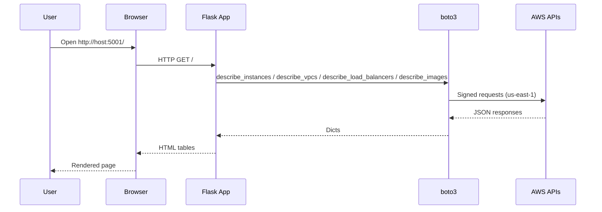
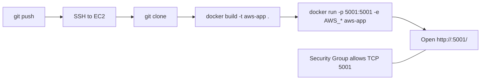
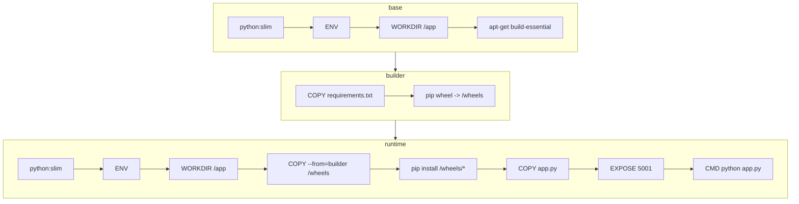

<div align="center">

# AWS Resources Viewer (Flask + Docker)

A small Flask app that lists AWS resources (EC2, VPCs, Load Balancers, AMIs) using boto3. The app listens on port 5001 and reads credentials from environment variables.

</div>

## Table of Contents
- [Overview](#overview)
- [Features](#features)
- [Project Files](#project-files)
- [Configuration](#configuration)
- [Install & Run](#install--run)
- [EC2 Deployment](#ec2-deployment)
- [Architecture & Diagrams](#architecture--diagrams)
- [Docker Build (Multi-Stage)](#docker-build-multi-stage)
- [Troubleshooting](#troubleshooting)
- [Credits](#credits)

---

## Overview
The app serves a simple HTML page with four tables: EC2 Instances, VPCs, Load Balancers and account‑owned AMIs. It targets region `us-east-1` and is designed to run as a lightweight Docker container locally or on EC2.

## Features
- EC2 Instances: state, type, and public IP.
- VPCs: ID and CIDR.
- Load Balancers (ALB/NLB): name and DNS.
- AMIs owned by the account.
- Friendly error handling so the page renders even without credentials/permissions.

## Project Files
- `app.py` — Flask app: boto3 calls and HTML tables.
- `Dockerfile` — Multi‑stage build: wheels in a builder stage and a slim runtime.
- `requirements.txt` — Dependencies (Flask, boto3).
- `image.png` — Example screenshot of the rendered page.

## Configuration
- Environment variables:
  - `AWS_ACCESS_KEY_ID`, `AWS_SECRET_ACCESS_KEY`.
  - Default region: `us-east-1` (hard‑coded in `app.py`).
- Networking: open `5001/TCP` locally or in your Security Group when deployed.

## Install & Run

Build:

```bash
docker build -t aws-app .
```

Run (with explicit credentials):

```bash
docker run -p 5001:5001 \
  -e AWS_ACCESS_KEY_ID=YOUR_KEY \
  -e AWS_SECRET_ACCESS_KEY=YOUR_SECRET \
  aws-app
```

Note: On Windows PowerShell use `$Env:VAR` to pass environment variables (for example `$Env:AWS_ACCESS_KEY_ID`).

Verify: open `http://localhost:5001/` or `http://<EC2_PUBLIC_IP>:5001/`.

## EC2 Deployment
1. SSH: `ssh ec2-user@<EC2_PUBLIC_IP>`.
2. Clone: `git clone <REPO_URL> && cd <REPO_FOLDER>`.
3. From the project directory, run the same commands from [Install & Run](#install--run) (Build then Run).
4. Ensure port `5001/TCP` is allowed in the Security Group.

## Architecture & Diagrams

Request → Render AWS data (sequence):



Build & Deploy pipeline (GitHub → EC2 → Docker):



## Docker Build (Multi-Stage)

The image is built in three stages to keep the runtime small, fast, and cache‑friendly:

- base: minimal build environment
  - `FROM python:<VERSION>-slim`
  - `ENV` (sane Python defaults)
  - `WORKDIR /app`
  - `apt-get install build-essential` (in case transitive deps need compilation)

- builder: build dependency wheels
  - `COPY requirements.txt .`
  - `pip wheel --no-cache-dir --wheel-dir /wheels -r requirements.txt`

- runtime: lean runtime only
  - `FROM python:<VERSION>-slim`
  - `ENV` + `WORKDIR /app`
  - `COPY --from=builder /wheels /wheels`
  - `pip install --no-cache-dir /wheels/*`
  - `COPY app.py ./`
  - `EXPOSE 5001`
  - `CMD ["python", "app.py"]`

Key benefits:
- Smaller image: no build tools in the runtime layer.
- Faster, reproducible installs: install from local wheels instead of the network.
- Better caching: changing app code doesn’t invalidate dependency layers.

Tip: To change the Python version at build time use `--build-arg PYTHON_VERSION=3.12`.

Mermaid diagram of the build stages:



## Troubleshooting
- Credentials: pass `AWS_ACCESS_KEY_ID` and `AWS_SECRET_ACCESS_KEY` to the container as environment variables.
- Region: default is `us-east-1`. To change it, update `REGION` in `app.py`.
- Permissions: make sure your IAM user/role allows `ec2:Describe*` and `elasticloadbalancing:Describe*`.
- Port/SG: confirm `5001/TCP` is open from your source network.

## Credits
This project was written by Alex-Y, a JB College student.
